# CloudCastle

  <picture>
    <source media="(prefers-reduced-motion: reduce)" srcset="assets/hero/hero-reduced.svg">
    <source media="(prefers-color-scheme: light)" srcset="assets/hero/hero-light.svg">
    
  </picture>

  <picture>
    <source media="(prefers-reduced-motion: reduce)" srcset="assets/hero/computational-dark.svg">
    <source media="(prefers-color-scheme: light)" srcset="assets/hero/computational-light.svg">
    
  </picture>

CloudCastle is an automated retail infrastructure platform with a premium market-facing site,
operator dashboard shell, and Supabase-ready data foundation.

## Stack
- Next.js App Router
- TypeScript
- Tailwind CSS
- Supabase SSR utilities

## Environment
Copy `.env.example` to `.env.local` and fill in:
- NEXT_PUBLIC_SUPABASE_URL
- NEXT_PUBLIC_SUPABASE_ANON_KEY
- SUPABASE_SERVICE_ROLE_KEY

## Development
npm run dev

## Build
npm run build

## Database
Run the SQL in `supabase/schema.sql` inside your Supabase SQL editor.
